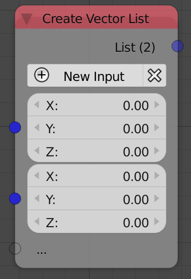
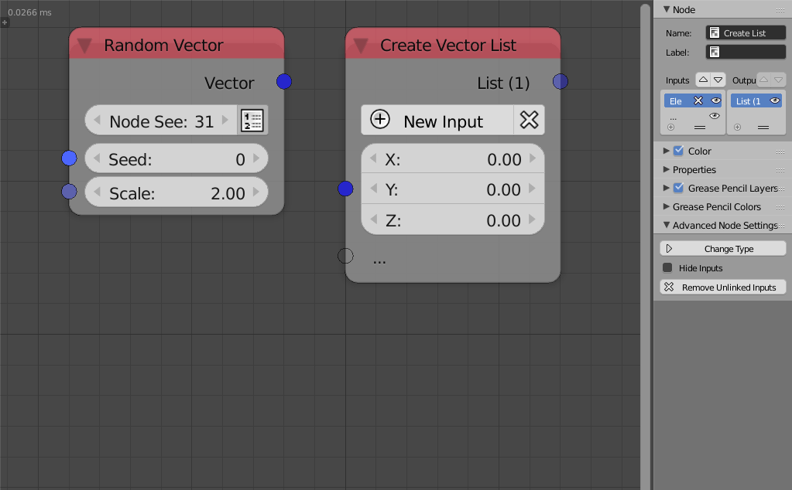

Vector List
===========

Description
-----------
This node is used to create an arbitrary list of vectors. A new vector can be added with the *New Input* button. A new vector can also be added by plugging it into the transperant socket.

Inputs
------
 
- **Vector** - A vector at the index 0.
- **Vector** - A vector at the index 1.
- **Vector** - ...

Outputs
-------
- **Vector list** - A list that contain all the input vectors.

Advanced Node Settings
-----------------------

- **Change type** - Change the type of the vector list to another list type.
- **Hide Inputs** - Hide all the inputs in the node.
- **Remove Inputs** - Remove all the inputs.

Caution
-------
A warning pop up when you use the *Remove All* button in the node, while if you used the the *Remove All* button in the *Advanced Node Settings* the inputs will be removed without a warning.

Examples of Usage
-----------------

