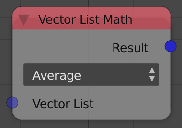
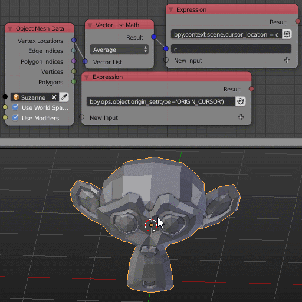

Vector List math
================

Description
-----------
This node performs 2 Vector math operations:

- **Add** - Add all the vectors in the input list.
- **Average** - Average the vectors in the input list.

Inputs
------

- **Vector List** - The vector list to operate on.

Outputs
-------

- **Result** - The result of vector math operations.

Advanced Node Settings
----------------------

- N/A

Examples of Usage
-----------------

