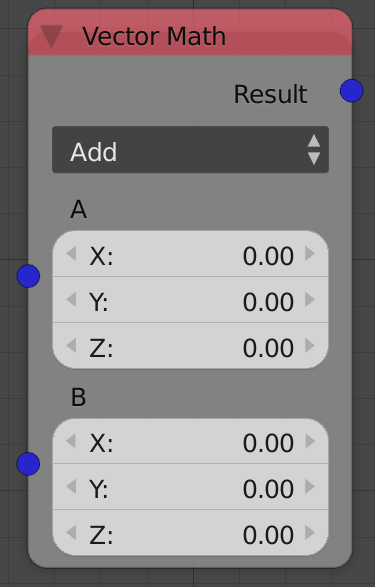
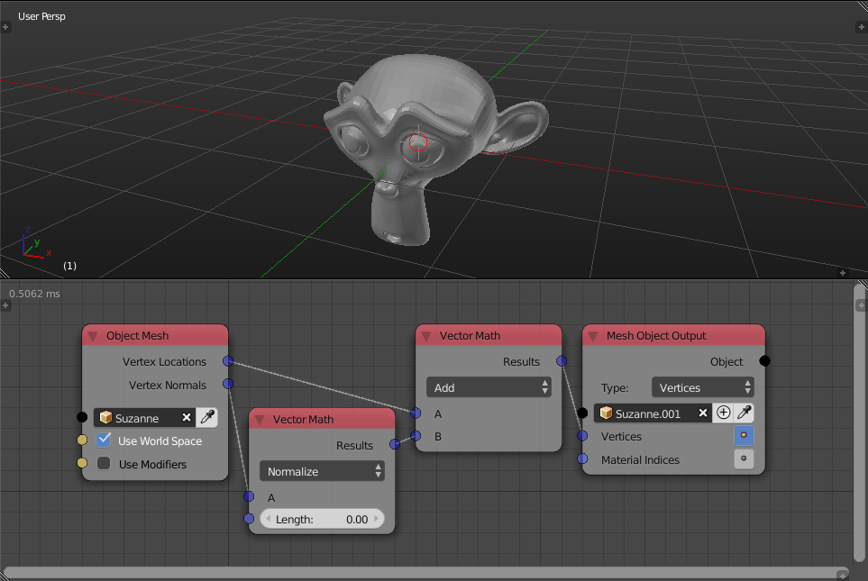
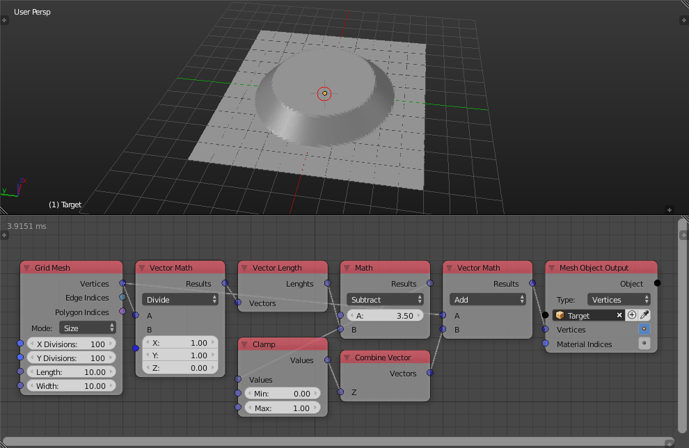
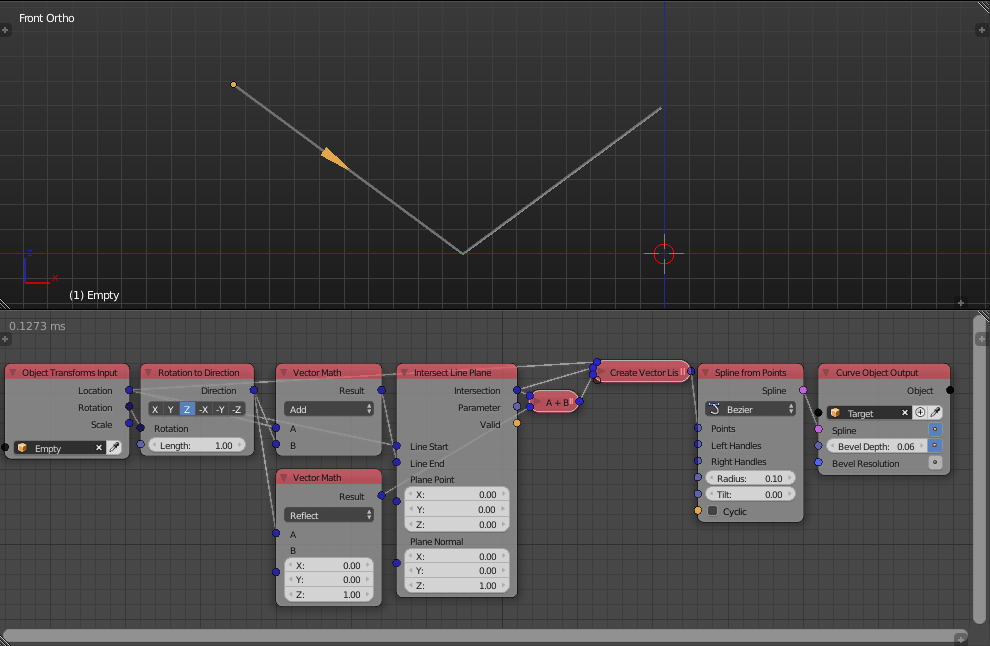

Vector Math
===========

Description
-----------

This node performs 11 vector math operations:

- **Add** - Add input vector A to input vector B.
- **Subtract** - Subtract input vector B from input vector A.
- **Multiply** - Multiply the components of input vector A by the components of input vector B.
- **Divide** - Divide the components of input vector A by the components of input vector B.
- **Cross product** - Returns the cross product of input vector A and input vector B.
- **Project** - Returns the projection of input vector A onto input vector B.
- **Reflect** - Returns the reflection vector of input vector A with normal as input vector B.
- **Normalize** - Set the magnitude of the input vector to a specific length.
- **Scale** - Perform a scalar multiplication to the input vector.
- **Absolute** - Absolute all the components of the input vector.
- **Snap** - Snap the the components of the input vector to a defined step size for each component.

Inputs
------

- **Vector A** - The first vector.
- **Vector B** - The second vector.

(Inputs are dynamic, Means the node has either one or two inputs based on selected operation. Those inputs can also be scalar or vectors based on the operation)

Outputs
-------

- **Result** - The result of vector math operations.

Advanced Node Settings
----------------------

- N/A

Notes
-----

- The **Project** operation will project the vector A on the extension of vector B regardless of its length.

Examples of Usage
-----------------

If the location of a point is defined by some vector ``A``, and we add some vector ``B`` to it, ``A`` gets moved in the direction of vector ``B``. Moreover, if ``B`` was set to the length of some scalar ``m`` using normalize operation, the vector ``A`` will move in the direction of ``B`` ``m`` units. A common node tree uses ``A`` and ``B`` as the location and the normal of the vertices respectively to achieve the following effect:

Dividing the space by some vector spatially scales whatever function you have:

The reflection of a vector from the ``xy`` plane:

