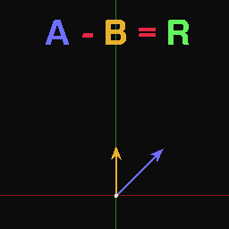
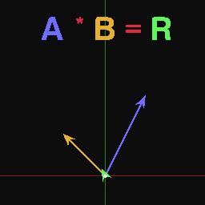
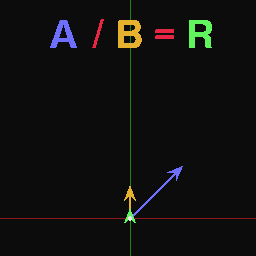
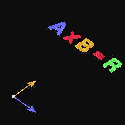
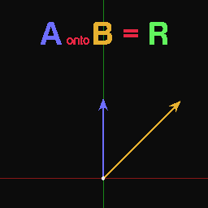
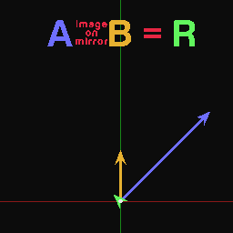
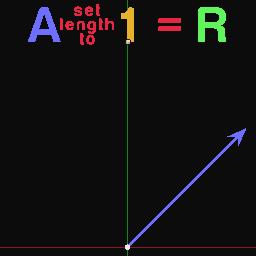
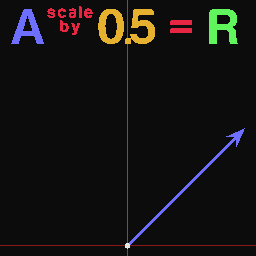
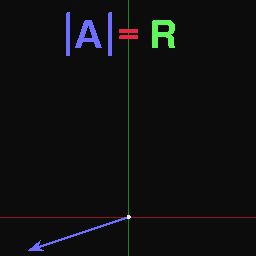
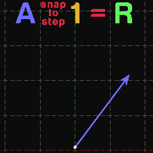

Vector Math
===========

Description
-----------
This node carries 11 vector math operation:

- **Add** - Add input vector A to input vector B.
- **Subtract** - Subtract input vector B from input vector A.
- **Multiply** - Multiply the components of input vector A by the components of input vector B.
- **Divide** - Divide the components of input vector A by the components of input vector B.
- **Cross product** - Returns the cross product of input vector A and input vector B.
- **Project** - Returns the projection of input vector A onto input vector B.
- **Reflect** - Returns the reflection vector of input vector A with normal as input vector B.
- **Normalize** - Set the magnitude of the input vector to a specific length.
- **Scale** - Perform a scalar multiplication to the input vector.
- **Absolute** - Absolute all the components of the input vector.
- **Snap** - Snap the the components of the input vector to a defined step size for each component.

.. image:: images/vector_math_node.png
   :width: 160pt

Inputs
------
 
- **Vector A** - The first vector.
- **Vector B** - The second vector.

(Inputs are dynamic, Means the node has either one or two inputs based on selected operation.Those inputs can also be scalar or vectors based on the operation)

Outputs
-------

- **Result** - The result of vector math operations.

Advanced Node Settings
----------------------

- N/A

Notes
-----

- The **Project** operation will project the vector on a hypothetical straight line that has the same location and slope of the input line if the input line was shorter than the projection.

Operations
----------

.. image:: gifs/vector_math_node_add.gif

