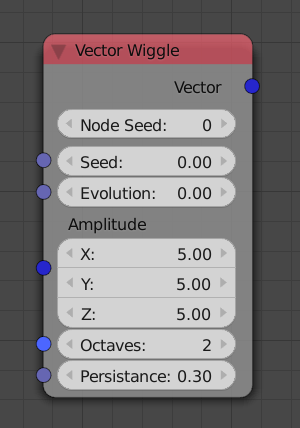

Wiggle
=============

**Node Seed:** If two nodes have the same value here, they will generate the same random vectors (when the seed is the same). This is like adding another random value to the *Seed* input.

**Seed:** Two *Randomize* nodes with the same seed will generate the vectors.

**Evolution:** Animate this input to get random movements.

**Speed:** The lower this is the faster are the movements.

**Amplitude:** Selected how far the vector moves in different directions.

For more detailed information for **Persistance** and **Octaves** read here: http://freespace.virgin.net/hugo.elias/models/m_perlin.htm