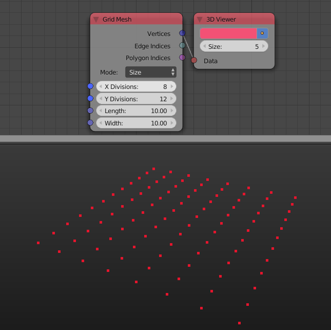

3D Viewer
=========

Description
-----------

This node draws points in the 3D viewport based on a list of vectors or transformation matrices that defines those points position.

Options
-------

- **Size** - The size of the points.
- **Color** - The color of the points.
