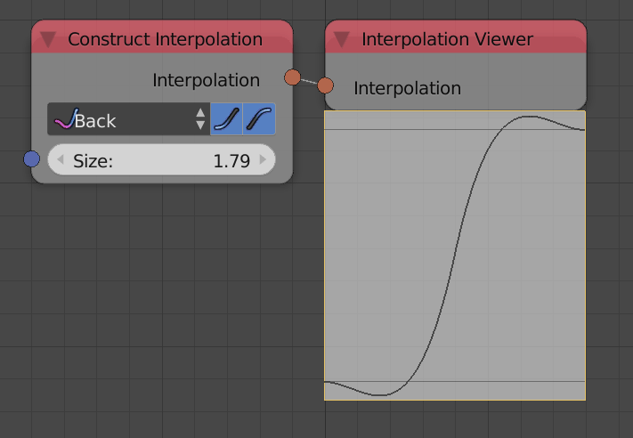

Interpolation Viewer
====================

Description
-----------

This node plot the input interpolation on a ``[0,1]`` range in a floating dedicated viewer.

Advanced Node Settings
----------------------

- **Resolution** - The number of points used to plot the interpolation.
