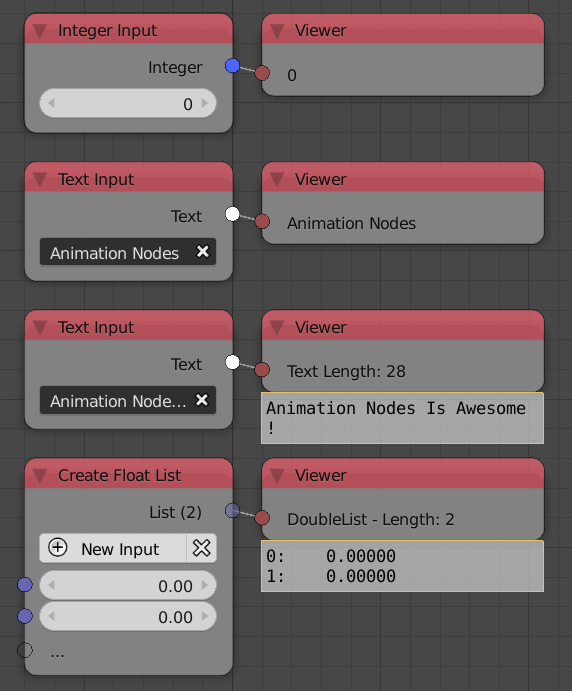

Viewer
======

Description
-----------

This node displays whatever input is given to it. Simple data types like integers and floats and small text will be drawn on the node itself. If Animation Nodes feels like data is a bit large like lists and big texts, it will draw a dedicated floating viewer to view those data.

Notice how integers, vectors and texts were displayed in the node, while lists where displayed in a dedicated floating viewer.

Advanced Node Settings
----------------------

- **Font Size** - The size of the drawn text on the dedicated floating drawer.
- **Max Rows** - Maximum amount of rows to draw for the dedicated floating viewer.
- **List Start** - The amount of list elements to display from the start.
- **List End** - The amount of list elements to display from the end.
- **Console** - If enabled, the data will be printed on the terminal.
- **Text Block** - If enabled, the data will be written on a blender data block.
