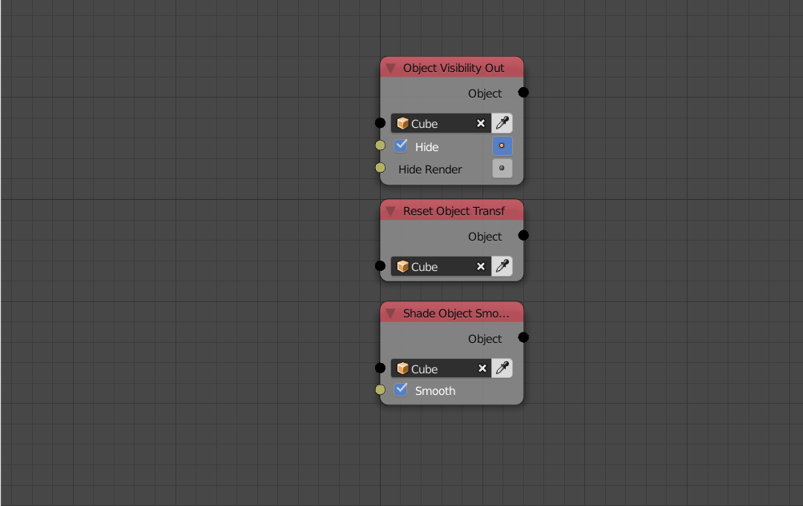
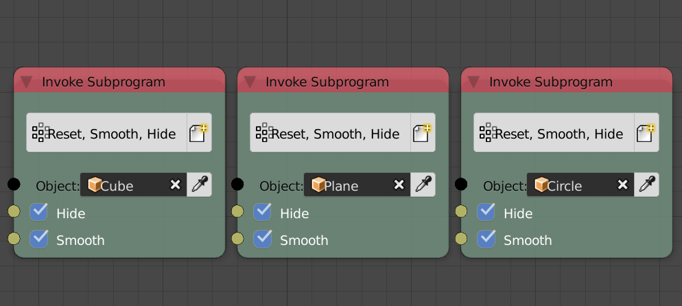
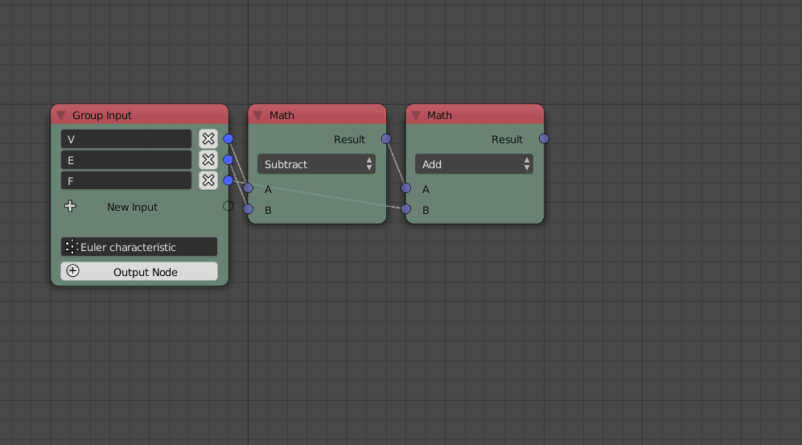
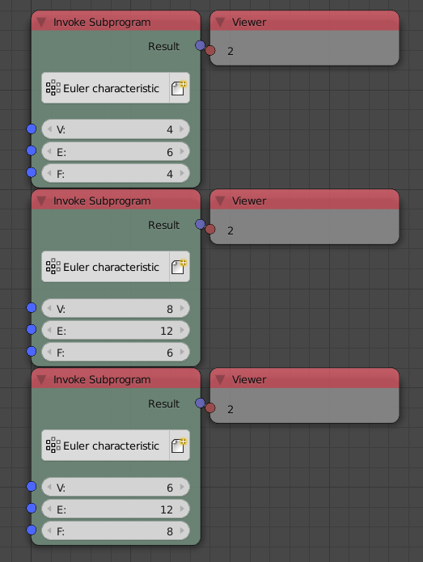

Group
=====

Lets us assume that you have three objects and you want to reset their transformations, hide them and shade them smooth. One might make a node tree for that and copy it three times for each object. This would be extremely inefficient both for performance and usability.

The solution is to use what is known as a **Group** or a **Function**, this group is a container that takes some inputs, do something with them and maybe output some data as well. Once the group is defined, it can be called using an **Invoke Subprogram** node and used multiple times in different areas of your node tree.

Example 1
---------

Below is a node tree, that reset input object transformations, hide the object and shade it smooth. And we are going to make a group out of it and expose the options.

This group has inputs but no outputs, it is what you might call an **Operational Group** because it doesn't return anything, it only does.

Had I defined the group, I can call it using the **Invoke Subprogram** node by searching for the group name or by adding it from the subprograms menu in the toolbar or from the nodes menu. Notice that I didn't have to copy the whole node tree for each of the three objects, I just copied the group, which is not only more organized but also faster!

Advanced Node Settings
^^^^^^^^^^^^^^^^^^^^^^

The group input node lets you define the default values for each of the inputs, it only works for basic data types like numbers, vector and booleans. Those values will be set to the invoke node as soon as you add it.

Example 2
---------

We will now make a group that takes some inputs, process them, then output some data. Our function will compute **Euler Characteristic** which is equal to ``V-F+E``.

After I implement the node tree and add the *group input* node, I can click the **Output Node** button in the *group input* node to add a *group output* node which I then can add my outputs to.

By invoking the group and input the values for the Tetrahedron, Hexahedron and Octahedron, we see that Euler Characteristic is indeed ``2`` for each of them.

Network Error
-------------

A network error is raised when there is something wrong with your connections. And it is raised in two main situations, if you connect a node that depend on the group to some node inside the group itself and if the *group output* node has no *group input* as it can't exist on its own.

If you removed the *Group Input* node without removing the *Group Output* node with it. An error will be raised because *Group Output* can not exist on it own. To fix this, you either remove it, or you add a new *Group Input* node, connect your outputs and then click **Use Input In Network** button which will scan the connected network for an *Input Group* node. Or you could click the plus button called *Add Input* to add a new *Group Input*.

.. image:: images/network_error.png
   :width: 200pt
