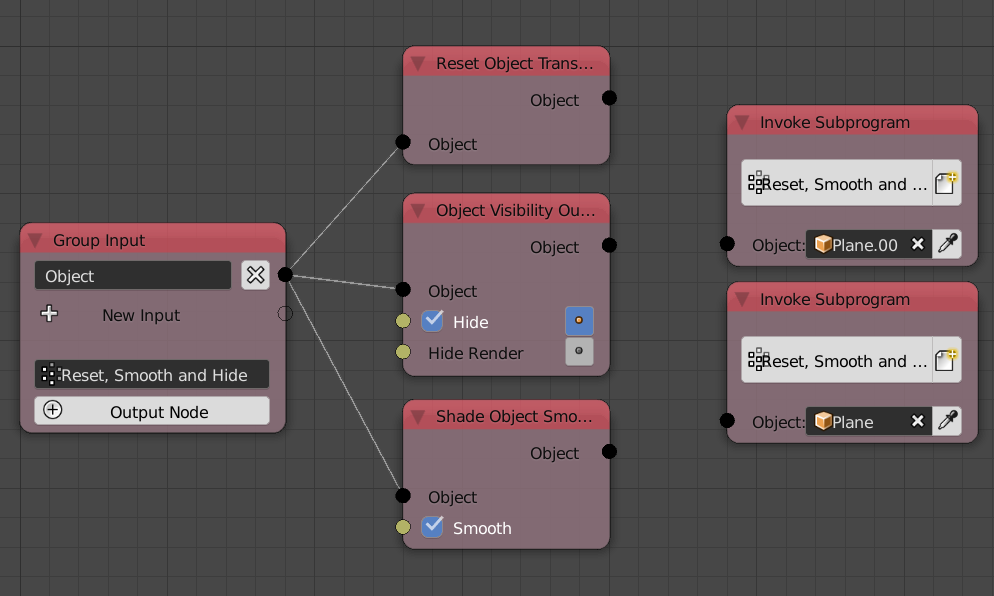
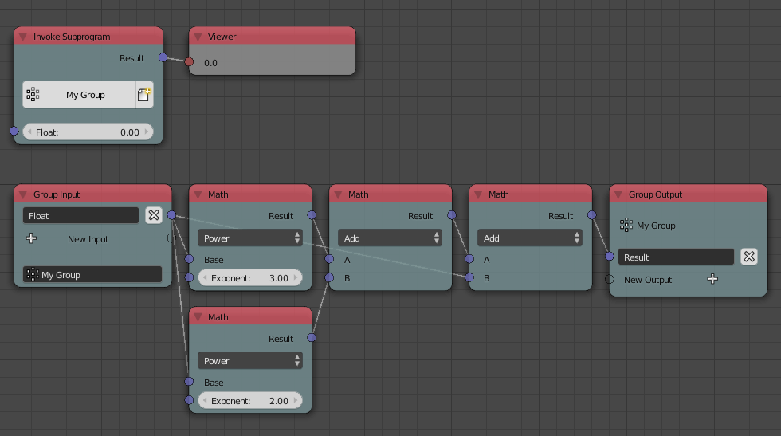
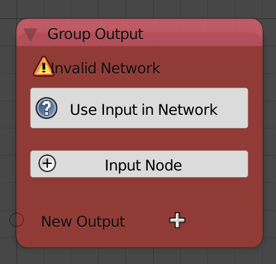

Group
=====

A *Group* is composed of two nodes, the **Group Input** and **Group Output** nodes. It is possible to use the **Group Input** node alone to define the *Group* but the **Group Output** can't be used alone to define the *Group*.

Group Input
-----------

A group that is defined only by a **Group Input** node is what you might call an **Operational Group** because it doesn't return anything, it only does.

We are going to make a group, that sets the input object smooth, reset its transformations and hide it. So I start by adding a new input to the **Group Input** node which is of type **Object** by clicking on the plus button or by connecting a node input to the transparent socket. Then I add the *Reset Transformation* node, *Shade Object Smooth* node and *Object Visibility Output* node and connect the input object to their input.

We have defined the group, let us now call it by adding an **Invoke Subprogram** node and choose our desired subprogram. I added two of them and input an object to each of them. Notice how we didn't have to add the whole node tree two times, we just defined it in a group and called the group two times.

Both objects should now be hidden, in the center of the world and set to smooth.

Group Output
------------

The *Output Group* node can be used to output some data after your process it inside the group.

We are going to make a group that represent the mathematical function ``f(x)= x^3+x^2+x``, it takes a number ``x`` and evaluate the previous equation at its value.

So I add a **Group Output** node by clicking on the plus button called **Output Node**. Then after I compute the value of the function, I plug the output of the last node to the transparent socket to get the output.

Then I call the group using the **Invoke Subprogram** node.

Network Error
-------------

A network error is raised when there is something wrong with your connections.

For instance, if you removed the **Group Input** node without removing the **Group Output** node with it. An error will be raised because **Group Output** can not exist on it own. To fix this, you either remove it, or you add a new **Group Input** node, connect your outputs and then click **Use Input In Network** button which will scan the connected network for an **Input Group** node. Or you could click the plus button called **Add Input** to add a new **Group Input**.

Advanced Node Settings
----------------------

Advanced node settings for the **Group Input** node contain the default values for your inputs. Defaults can only be set to basic data types like floats an integers.
