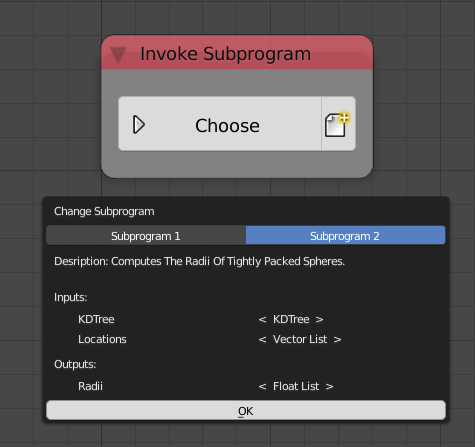
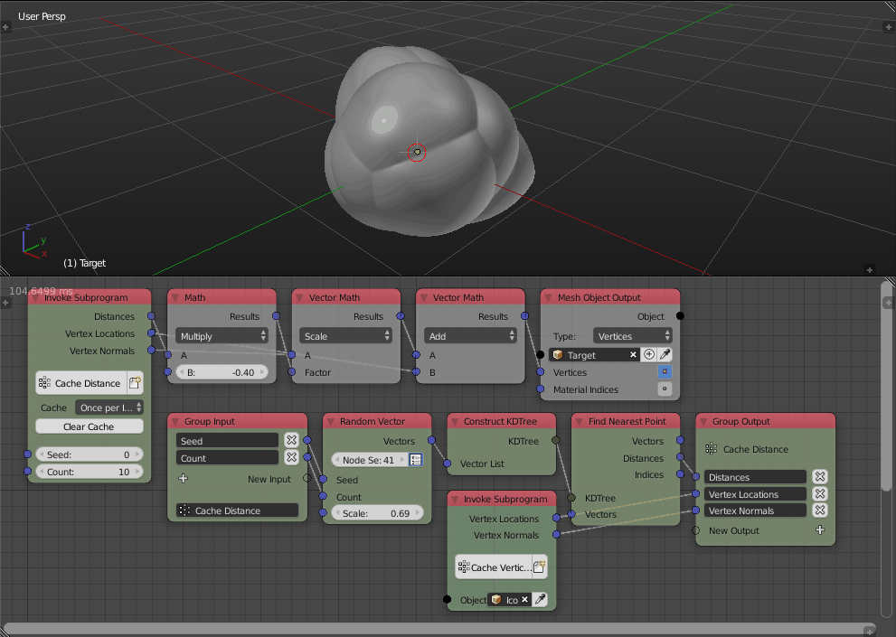

Invoke Subprogram
=================

The *Invoke Subprogram* node is used to call a subprogram, one can invoke a subprogram defined in any of the node trees in the scene. The *Choose* button lets you choose the required subprogram to invoke, a list of subprograms will be promoted listing their descriptions, inputs and outputs.

We can see that there are two subprograms in the scene, *Subprogram 1* and *Subprogram 2*, the latter of which has two inputs, *KD Tree* and *Locations* of type *KD Tree* and *Vector List* respectively and one output *Radii* of type *Float List* as well as a description describing what the subprogram does.

The node also have an *Insert Empty Subprogram* operator which will add an empty subprogram definition of a type of your choosing and set it as the required subprogram to invoke.

Caching
-------

The invoke node provides a caching mechanism for Animation Nodes. Caching is the process of storing the outputs of the subprogram in memory, in future executions, the subprogram is not executed and instead, the stored output is returned. The node provides three mechanisms for storing and updating the cache, that is, recomputing the outputs and storing them. The cache can be cleared to force  recomputation of the outputs.

.. note::

	Cache is automatically cleared whenever the subprogram definition change.

The caching options are available in the *Advanced Node Settings* of the node which include an option *Show Cache Options* that shows the options in the node itself. Caching is disabled by default and if enable can be cleared by pressing the *Clear Cache* button.

One Time
^^^^^^^^

This mechanism stores the cache and never updates it unless it was cleared. A typical use for this mechanism is to cache data that are expensive to compute yet it never changes, by using caching, one avoid needlessly recomputing the data at each execution. For instance, if one was parsing a log composed of some 100k lines, splitting the file by lines would take roughly 25ms, since the log is constant regardless of any factor, one can cache the resulted text list saving 25ms from one's execution time. The caching can be done by encapsulating the split node in a group and enabling *One Time* cache option.

.. image:: images/one_time_cache.png

Once Per Input
^^^^^^^^^^^^^^

This mechanism stores multiple caches, one cache for every combination of inputs. Note that this mechanism is only available for input data types that are comparable, that is, data types that can be shown to be equal, for instance, it is possible to compare integers, booleans and floats, however, it is not possible to compare KD and BVH trees. This mechanism is particularly useful if your inputs have a known range and a limited number of possibilities.

.. warning::

	Avoid editing floats (And their derivatives like vectors, matrices and quaternions) when using this mechanism because for every input there will be a cache and this will consume your memory in no time!

For instance, if one were to offset the vertices of a mesh along their normals based on a distance Voronoi diagram, the distance computation would be very expensive for high poly meshes. One can encapsulate the distance computation node tree in a group exposing the seed and number of cells as inputs and enable *Once Per Input*, by doing so, each input combination will cache its resultant distances and will be used in the future if the the combination is used again.

Notice how the node tree takes around 100ms to execute the first time we enter each combination of inputs while it only takes around 7ms if we enter the same combination again indicating that for the second time, the node uses the cache instead of recomputing the output.

Once Per Frame
^^^^^^^^^^^^^^

This mechanism stores multiple caches, one cache for every frame and sub-frame if available. This is particularly useful if you have a time based animation that is expensive to compute and want to view it in realtime for fine tuning purposes or for easing other stages of production like shading and rendering.

For instance, if the cells of the previous example were wiggling based on time, one could encapsulate the distance computation node tree inside a group and enable *Once Per Frame*, by doing so, each frame will have its own cache and after running the animation once, the animation can be viewed in realtime.

.. image:: gifs/once_per_frame_cache.gif

Notice how the fps for the first run was around 17 while it is maxed at future runs indicating that future runs uses cache instead of recomputing the outputs.
