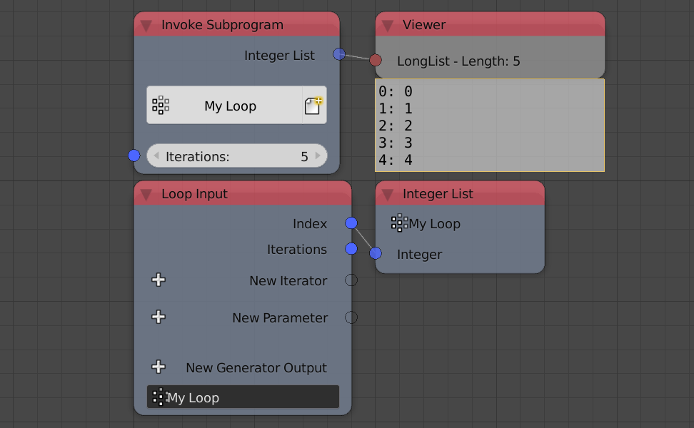
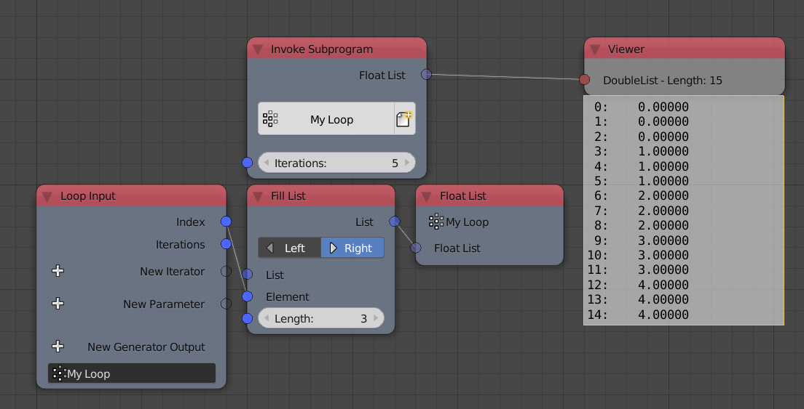
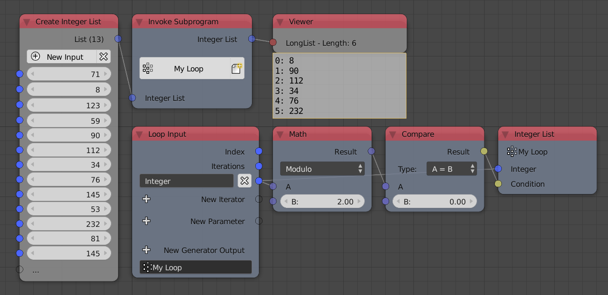
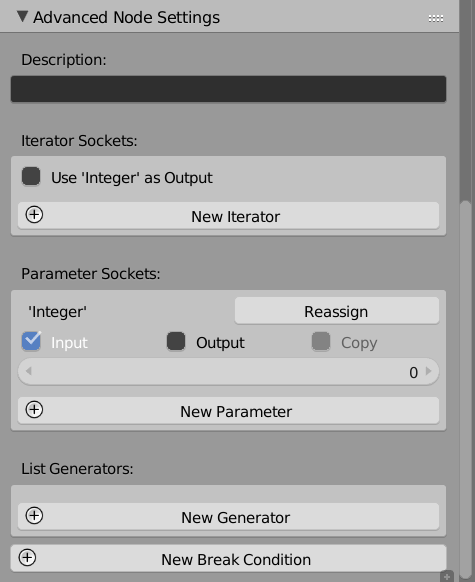
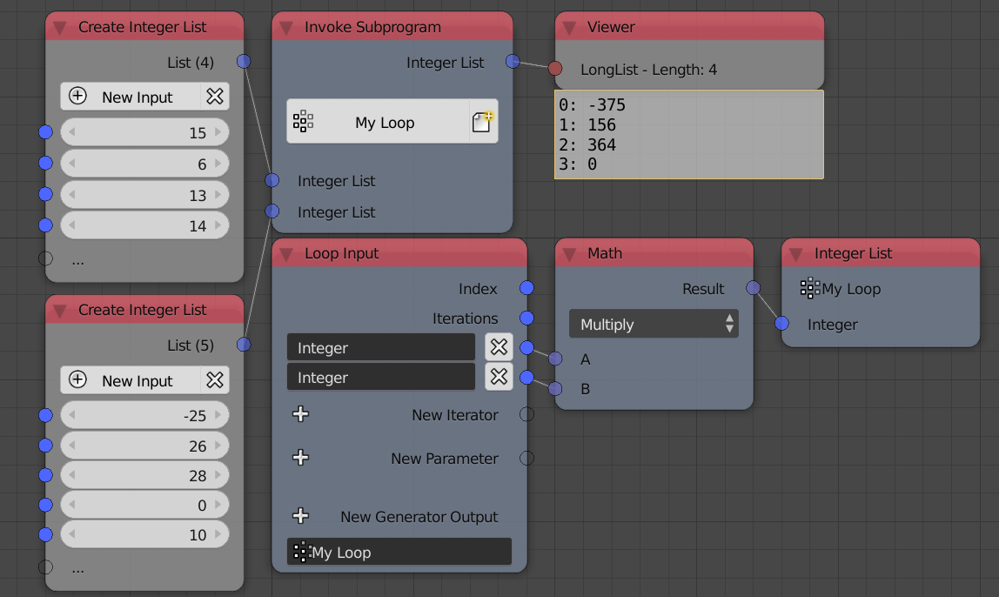
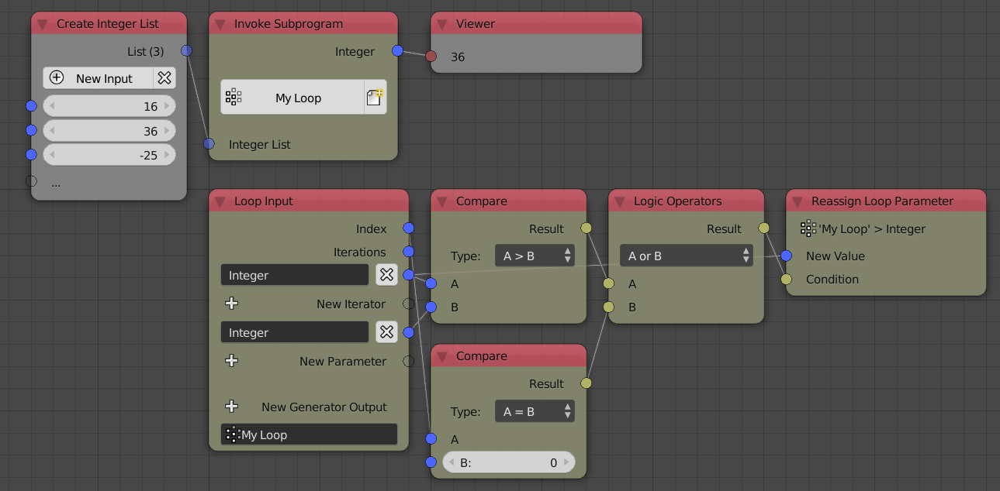
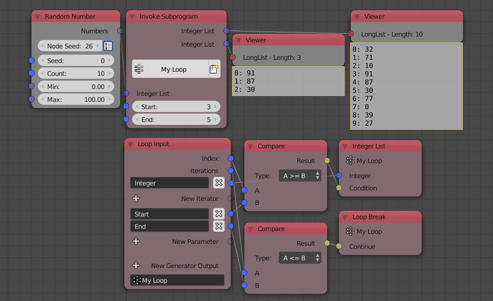

Loop
====

Loops are subprograms that runs specific number of times, it can be used to repeat an action multiple times or to automate some action.

Example 1
---------

By default, there is a parameter called **Iterations** and it defines the number of times the subprogram will run, lets say we defined it to be 5, then the loop will run 5 times. Each run has a distinct variable called **index** that starts from zero and ends by `n-1` where `n` is the number of runs which is 5 in this case. This means that at the first run, *index* will be 0, at the second run, the index will be 1, at the third run, the index will be 2, and so on. There exist another variable **Iterations** that is constant for all runs and is equal to the numbers of runs or iterations, which is 5 in our example.

As you may see, we have a parameter called **Iterations** and two inputs called **Index** and **Iterations**, if I viewed both inputs using the *Loop Viewer* node (Which prints inputs of each run in a separate line), you will see that the index of the first run (first line) is 0 and its iteration is 5, the index of the second iteration is 1 and its iteration is 5, and so on.

Example 2
---------

Loops enable us to append values computed inside the loop to some output list, the the output list will contain the value computed at the first iteration as the first element, the value computed at the second iterations as the second element and so on. Those outputs are called generators and can be added by clicking on the **New Generator Output** button and then choosing their type.

.. image:: images/loop_example2a.png

As you may see, we added a new integer generator output which appends the index each iteration. And the output is an integer list that contain the indices.

.. image:: images/loop_example2b.png

If I divided the index by the iterations minus one, the resulted list will include floats that ranges between zero and one. This is because indices ranges between zero and `n-1` where `n` is the number of iterations. Notice that we changed the output generator to float.

.. image:: images/loop_example2c.png

Loops can also append multiple elements at the same time when given a list.

Example 3
---------

The output generators has a hidden by default input called **Condition** which is a boolean. This input basically asks you "Should I append the input value?" if the boolean was True then it is appended normally, if it was False, then the value is not appended.

In the above example, we only append the value if the index is an even integer resulting in a list of even numbers. We notice that the output list length can be different that the input iterations.

Example 4
---------

Loops can loop over a list of values, that is, for each value in the input list of values, the loop will run, so it should be noted that the number of iterations is equal to the length of the list. A new input will appear which include the value in the list at the current index, so at the first iteration, the value will be the first value in the list, in the second iteration, the value will be the second value in the list, and so on. A new iterator can be added by clicking on the **New Iterator** button.

.. image:: images/loop_example4a.png

In the above example, we append the integer if and only if it's an even number. So if you compared the input list to the output list you will see that all odd numbers are not included.

Multiple iterator lists are permitted and in this case, the number of iterations will be equal to the the length of the smallest list.

.. image:: images/loop_example4b.png

The above example multiply two lists, notice that the second list has an 5 elements while the first list has only 4 and subsequently the loop only runs 4 times and the output is a list of four elements.

Example 5
---------

Loops can have parameters which are constant for all iterations. A new parameter can be added by clicking on the **New Parameter** button.

The above example double all the elements of the input list.

Advanced Node Settings
----------------------

Each Parameter and iterator have some options which can be edited in the **Advanced Node Settings** of the subprogram.

Description
^^^^^^^^^^^

A description for the function of the loop. This description only appears in the **Invoke Subprogram** node when choosing the required subprogram, however, it is a good practice to write a description for each subprogram so that other users can understand its function.

Example 6
---------

Each iterator has an option **Use Iterator As Output** which if enabled will just add the input iterator as an output, this option may seem useless but it actually have a specific function which is to define the operation flow, look at the following example.

Let us assume that we want to hide a group of objects then unhide them again for no good reason. One could make a loop that hide and unhide objects then invoke that loop twice, one for hiding and one for unhiding, and this is what we did in the left setup. However, it doesn't work, my objects are still hidden even though I unhide them using the upper loop, this happens because Animation Nodes doesn't know which loop to execute first so it just executed the hiding loop last and that's why our objects are hidden. So to ensure that a loop will execute before another and since they both take the object list as input. We expose the iterator as an output then use that output for the second loop, this is how it the right setup work.

Example 7
---------

Each parameter has couple of options including:

- **Input** - If enabled, the parameter will be visible as an input.
- **Output** - if enabled, the parameter will be visible as an output.
- **Copy** - If enabled, the parameter will be copied.

To make sense of those options, we first need to understand the **Reassign** option. When adding a new reassign node for a parameter, you will have the ability to change that parameter as the loop run, lets look at the following example to understand this better.

The above example finds the maximum number in the input integer list. We first add a parameter and disable it as an input and enable it as an output, that way, it is not visible as an input but it is visible as an output. I add a reassign node for that parameter and make its condition visible. At each iteration, I check if the iterator value is larger than the value of the parameter and if it is, I assign the iterator value to the parameter, I also add another condition such that if the index is zero (if it is the first iteration) then I automatically reassign even if the iterator value is not larger than the parameter value.

At the first iteration, the iterator was 16 and it gets assigned to the parameter because of the equal to zero condition, at the second iteration, the iterator was 36 which is larger than the current parameter value which is 16 (assigned from the last iteration), so I reassign the parameter to be 36, at the third iteration, the iterator is -25 which is not larger than the current value of the parameter 36 so we don't assign it. Since we enabled the output option for the parameter, it is available as an output for the subprogram carrying the last assigned value which was 36 which is the largest value.

Example 8
---------

The last feature of loops is the break condition which is a boolean. A break condition basically asks you every iteration "Should I proceed to the next iteration?", if it is True, the loops carry on executing the loop, it if was False, the loop exist after current iteration and doesn't carry on executing other iterations.

The example above slice a list, in other words, it returns a list with that starts at a specific index and ends with another in the input list. This can be done using a generator condition where I append the value if it is larger than the start index and lower than the end index, but this would be inefficient, if my list contain 100 element and I only want the first 3 elements, the loop will have to run 100x. The solution is to use a break condition, to basically exist the loop when you are sure that no other elements are needed.

More Examples
^^^^^^^^^^^^^

A lot of nodes documentation include loop examples, so make sure to browse some nodes for more example on loops.
