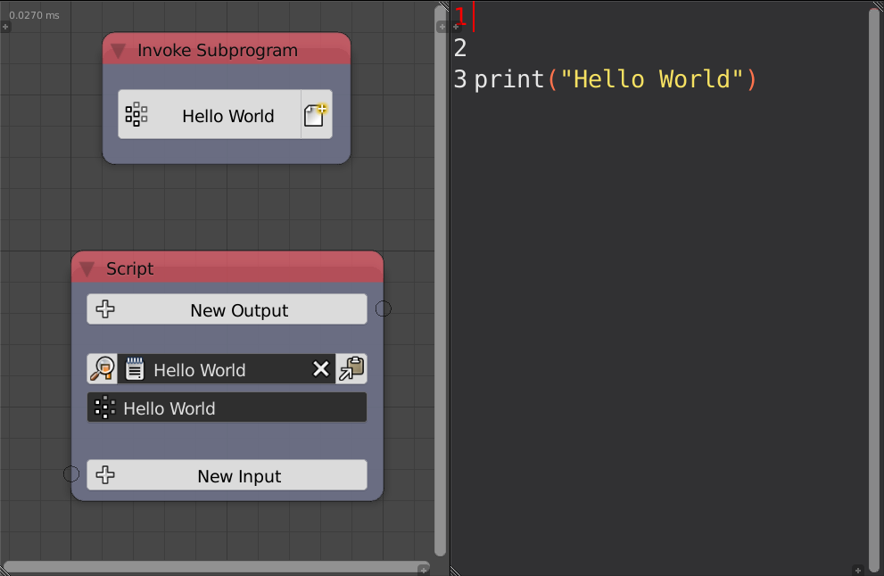
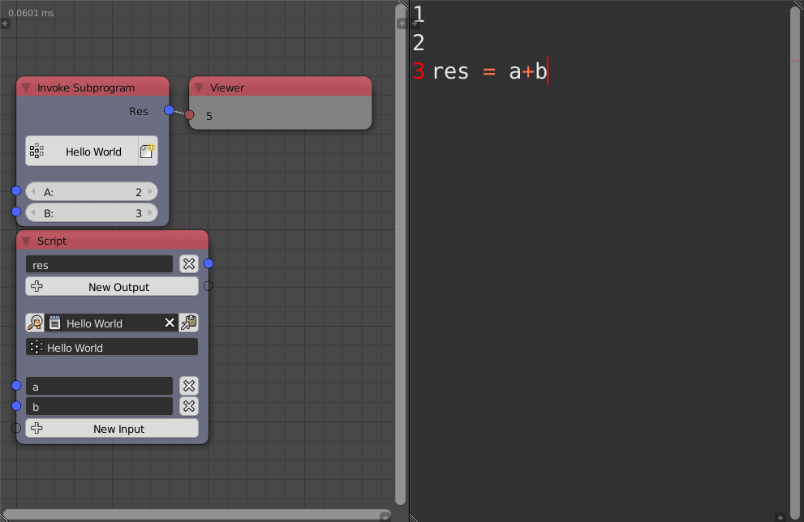
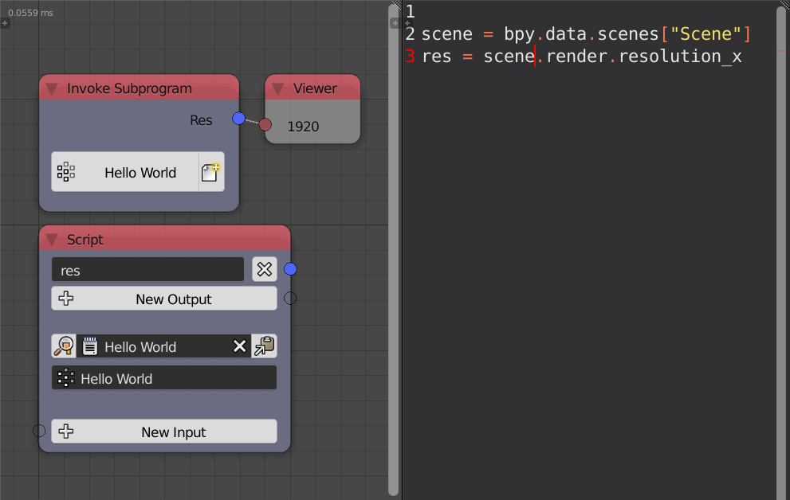

Script
======

Animation Nodes provide you with a lot of helpful nodes for variaty of applications, however, some nodes may have some limitations and thus force you to write some code. The script node enables you to write python code and invoke it inside your node tree without having to write new nodes.

Example 1
---------

In this example, the script just prints **Hello World** it doesn't have any inputs or outputs.

Example 2
---------

In this example, two inputs were given and an output is expected. When you add an input, it is as if you initialized a variable with its name at the top of you code, do in our case, it is like we write `a, b = 2, 3`. The output is expected to be initialized with the same name as the output name, so in your code, you have to equate `res` with a value which in our case was the sume of the input values.

Example 3
---------

In this example, the node return the x resolution of the scene. It doesn't have any inputs. Notice that I didn't have to import the blender python API (bpy) thats because it is already imported in Animation Nodes. However, we can import any modules we need assuming they are installed of course. Star imports won't work because they are bad for performance, so something like `from bpy import *` won't work.

Advanced Node Settings
----------------------

- **Description** - A description for the function of the script. This description only appears in the **Invoke Subprogram** node when choosing the required subprogram, however, it is a good practice to write a description for each subprogram so that other users can understand its function.
- **Interactive Mode** - If enabled, animation nodes will automatically import changes you make in the text editor. If disabled, a button will appear **Import Changes** that enables you to import changes manually when needed.
- **Debug Mode** - If anbled, errors in the script will be drawn on the node. If disabled, errors becomes fatal ones and will stop node executions till solved, so it is better to leave this option enabled.
- **Initialize Missing Outputs** - If enabled and outputs are not initialized, they will get initialized with their default values, avoiding not type errors.
- **Correct Output Types** - If enabled, AN will try to correct output types as much as possible and return default value if it couldn't. For instance, if the output is an integer and it was initialized with a float, it will get converted to an integer by rounding.
